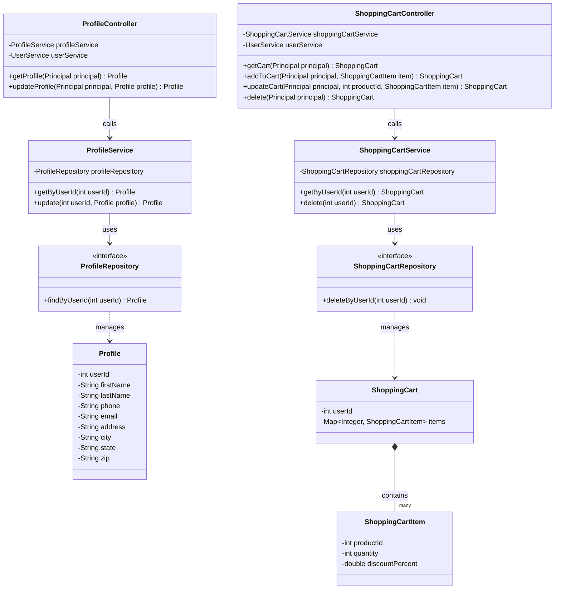

# E-Commerce REST API Capstone

A backend e-commerce application built with **Java**, **Spring Boot**, and **Spring Data JPA** that exposes a secure RESTful API for product browsing, user authentication, profile management, persistent shopping carts, and transactional order processing.

The application follows a layered architecture (**Controller → Service → Repository**) to maintain clean separation of concerns while leveraging a normalized MySQL database for persistent storage.

---

# Features

## Product Catalog
- Browse all product categories
- View all available products
- Filter products by:
  - Category
  - Minimum price
  - Maximum price
- Retrieve detailed information for a single product

## Authentication & Authorization
- User registration
- JWT-based authentication
- Password encryption using Spring Security
- Protected endpoints requiring Bearer Token authentication

## Shopping Cart
- Persistent shopping cart for authenticated users
- Add products to cart
- Update product quantities
- Remove all cart items
- Cart persists between login sessions

## User Profiles
- Automatically creates a profile when a user registers
- View profile information
- Update shipping and contact information
- Users can only access their own profile

## Checkout & Orders
- Convert shopping cart into an order
- Store order header and order line items
- Preserve historical product prices by snapshotting prices at checkout
- Automatically clear shopping cart after successful checkout

---

# Architecture

The project follows a traditional Spring layered architecture.

```
Client (Insomnia / Frontend)
            │
            ▼
     Controllers
            │
            ▼
       Services
            │
            ▼
     Repositories
            │
            ▼
      MySQL Database
```

### Controller Layer
- Handles HTTP requests
- Maps REST endpoints
- Performs request validation
- Retrieves authenticated user information

### Service Layer
- Contains business logic
- Coordinates application workflows
- Performs calculations
- Manages transactions

### Repository Layer
- Uses Spring Data JPA
- Generates SQL automatically
- Handles database operations

---

# Project Phases

## Phase 1 – Product Catalog

Public endpoints for browsing inventory.

Features:
- View categories
- View products
- Product filtering
- Product lookup by ID

---

## Phase 2 – Authentication

Implemented using Spring Security and JWT.

Features:
- User registration
- Password hashing
- JWT login
- Protected endpoints using Bearer Tokens

---

## Phase 3 – Shopping Cart

Persistent shopping cart stored in the database.

Features:
- View cart
- Add products
- Update quantities
- Remove items
- Cart persists across sessions

---

## Phase 4 – User Profile

Each registered user has an associated profile.

Features:
- Retrieve profile
- Update profile
- Secure profile ownership
- Authentication required

---

## Phase 5 – Checkout

Processes shopping cart into completed orders.

Features:
- Creates order records
- Creates order line items
- Stores product price snapshots
- Clears cart after checkout

---

---

# Class Diagram

The following UML class diagram illustrates the relationships between the Shopping Cart and User Profile modules. It highlights the layered architecture, showing how controllers interact with services, services interact with repositories, and repositories manage the underlying domain models.



# Tech Stack

| Technology | Purpose |
|------------|---------|
| Java 17+ | Programming Language |
| Spring Boot | Application Framework |
| Spring Security | Authentication & Authorization |
| JWT | User Authentication |
| Spring Data JPA | ORM/Data Access |
| Hibernate | Persistence Provider |
| MySQL | Database |
| Maven | Dependency Management |
| Insomnia | API Testing |
| MySQL Workbench | Database Management |

---

# Database Schema

```
users
-----
id (PK)
username
password
role

        │
        │ 1 : 1
        ▼

profiles
--------
user_id (PK/FK)
first_name
last_name
address
city
state
zip

        │
        │ 1 : 1
        ▼

shopping_cart
-------------
user_id (PK/FK)

        │
        │ 1 : N
        ▼

shopping_cart_items
-------------------
product_id
quantity

        │
        │ 1 : N
        ▼

orders
------
order_id (PK)
user_id (FK)
date
shipping_address
city
state
zip

        │
        │ 1 : N
        ▼

order_line_items
----------------
order_line_item_id (PK)
order_id (FK)
product_id (FK)
quantity
price
```

---

# API Endpoints

## Public Endpoints

### Categories

| Method | Endpoint | Description |
|--------|----------|-------------|
| GET | `/categories` | Retrieve all categories |

### Products

| Method | Endpoint | Description |
|--------|----------|-------------|
| GET | `/products` | Retrieve all products |
| GET | `/products/{id}` | Retrieve a specific product |

Supports query parameters:

- `categoryId`
- `minPrice`
- `maxPrice`

---

## Authentication

| Method | Endpoint | Description |
|--------|----------|-------------|
| POST | `/register` | Register a new user |
| POST | `/login` | Authenticate user and return JWT |

---

## Protected Endpoints

### Profile

| Method | Endpoint | Description |
|--------|----------|-------------|
| GET | `/profile` | Retrieve current user's profile |
| PUT | `/profile` | Update current user's profile |

---

### Shopping Cart

| Method | Endpoint | Description |
|--------|----------|-------------|
| GET | `/cart` | Retrieve current shopping cart |
| POST | `/cart/products/{id}` | Add product to cart |
| PUT | `/cart/products/{id}` | Update product quantity |
| DELETE | `/cart` | Clear shopping cart |

---

### Orders

| Method | Endpoint | Description |
|--------|----------|-------------|
| POST | `/orders` | Checkout and create order |

---

# Security

Protected endpoints require a valid JWT Bearer Token.

Example:

```http
Authorization: Bearer <your-jwt-token>
```

Authentication flow:

1. Register a new account
2. Login using credentials
3. Receive JWT
4. Include JWT in Authorization header for protected requests

---

# Installation

## Prerequisites

- Java 17 or higher
- MySQL Server 8+
- Maven
- IntelliJ IDEA (recommended)
- MySQL Workbench
- Insomnia (optional)

---

## Clone Repository

```bash
git clone https://github.com/yourusername/ecommerce-api.git

cd ecommerce-api
```

---

## Configure Database

Import the provided SQL schema into MySQL.

Update `application.properties`:

```properties
spring.datasource.url=jdbc:mysql://localhost:3306/your_database_name
spring.datasource.username=your_username
spring.datasource.password=your_password
```

---

## Run the Application

Using Maven:

```bash
mvn spring-boot:run
```

Or run the Spring Boot application directly from IntelliJ.

The server will start on:

```
http://localhost:8080
```

---

# Testing

The API can be tested using:

- Insomnia
- Postman
- cURL

Import the provided API collection to quickly test all endpoints.

---

# Future Improvements

- Product image uploads
- Product reviews and ratings
- Wishlist functionality
- Inventory management
- Admin dashboard
- Order history
- Payment gateway integration
- Email notifications

---

# License

This project was developed as part of a Spring Boot E-Commerce REST API Capstone project for educational purposes.
